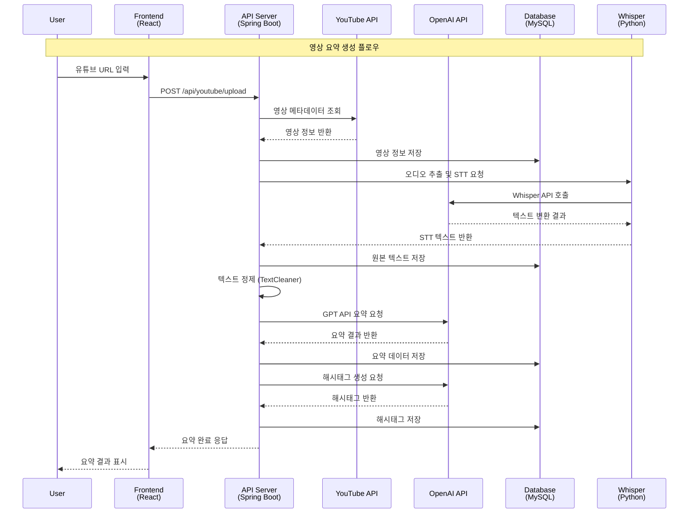
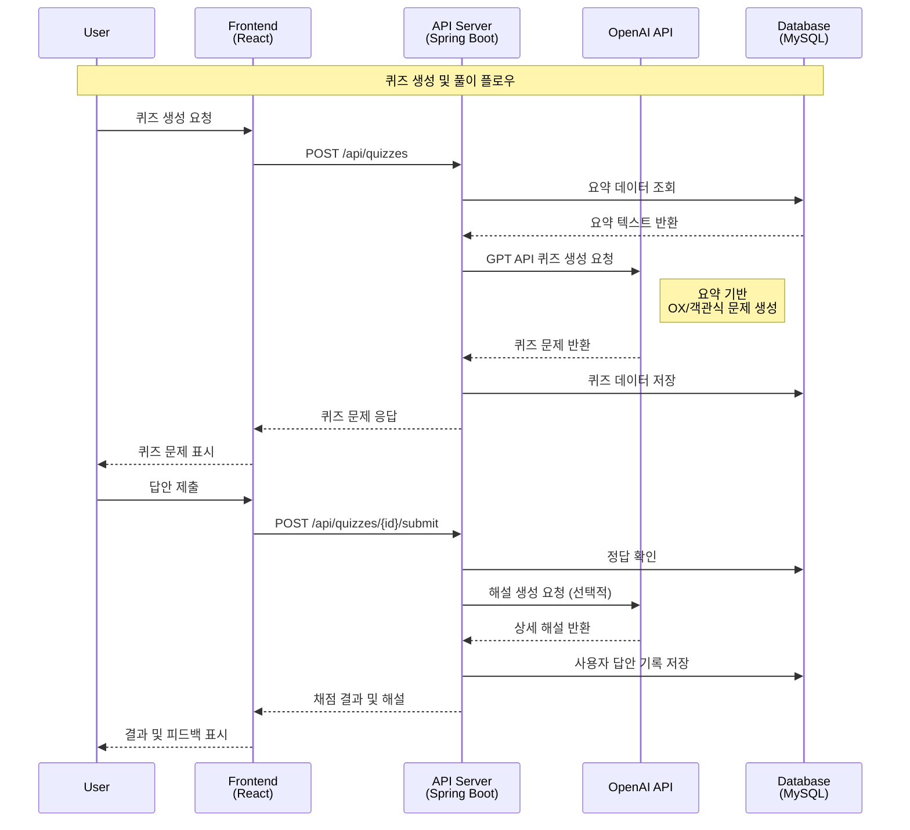
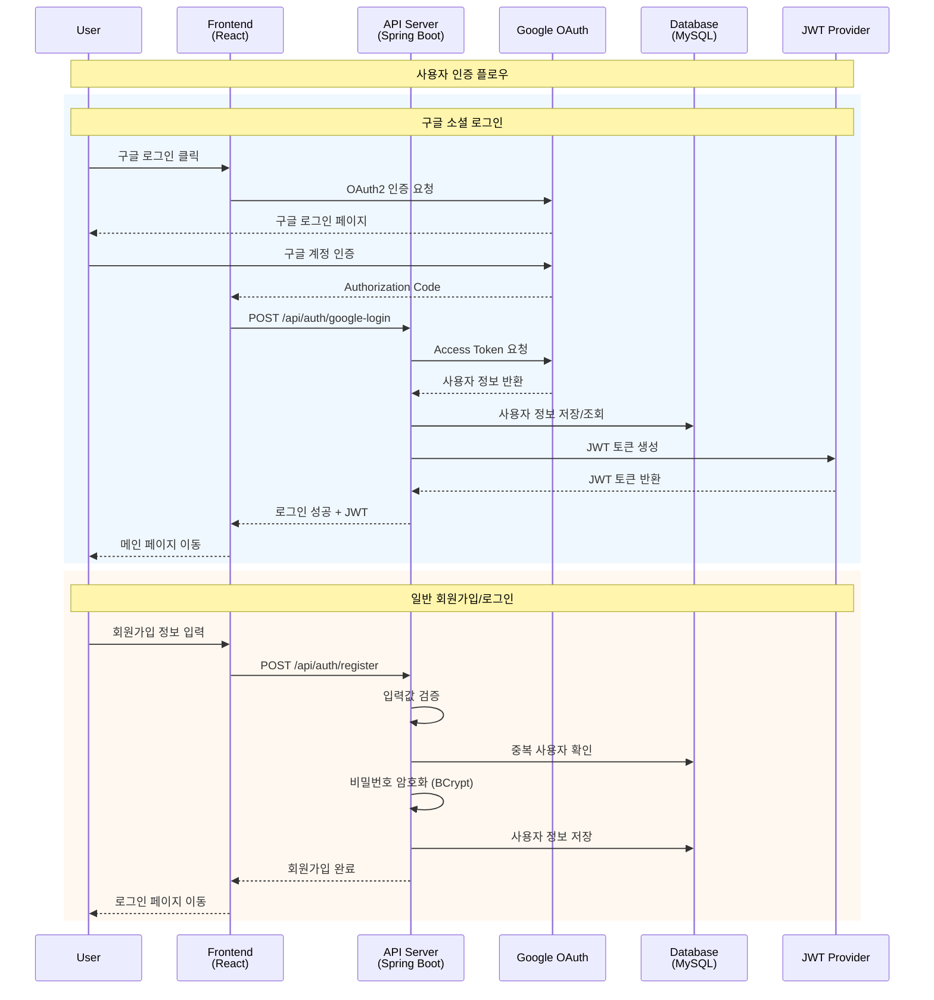
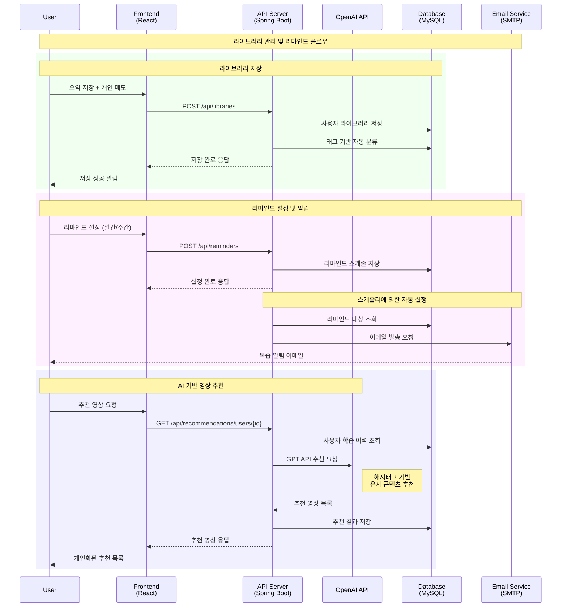
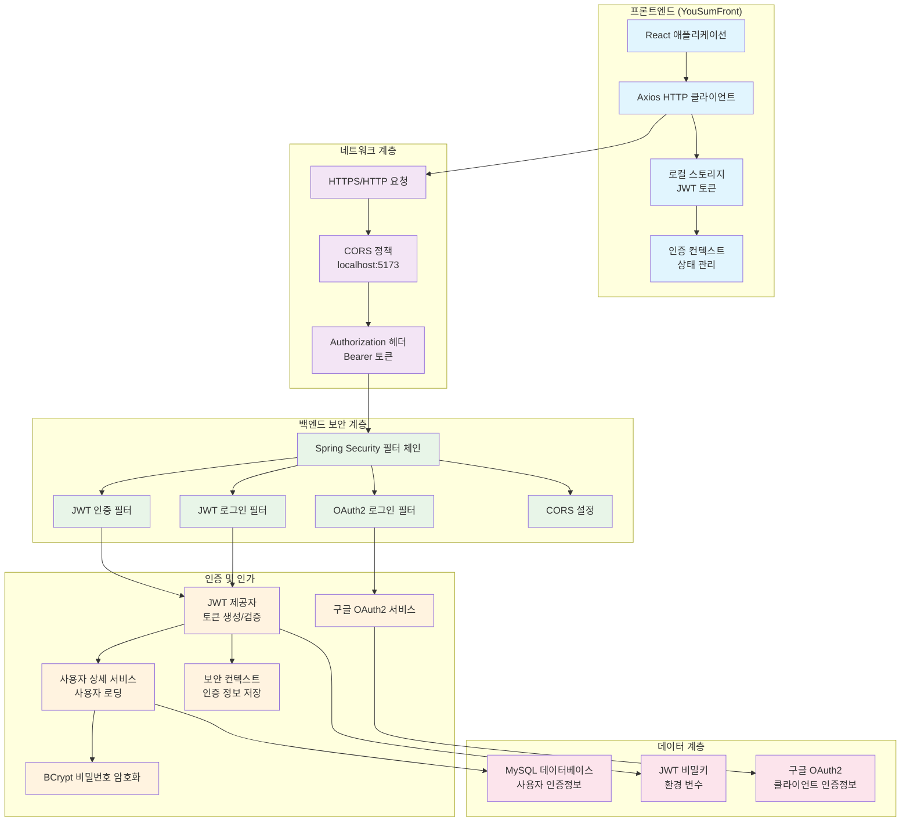
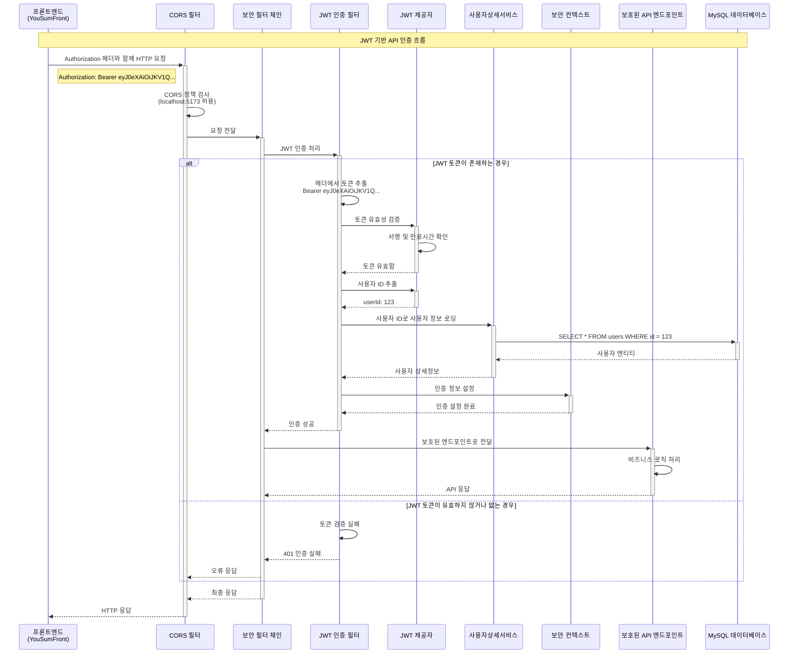
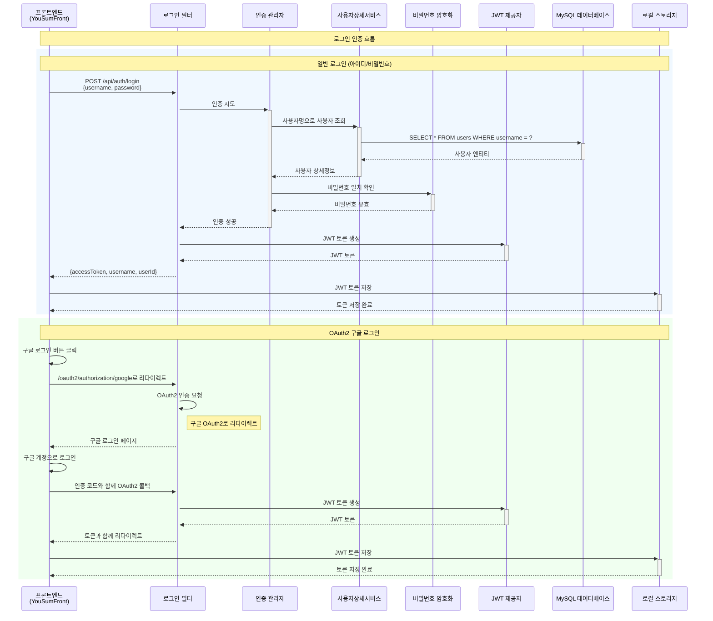
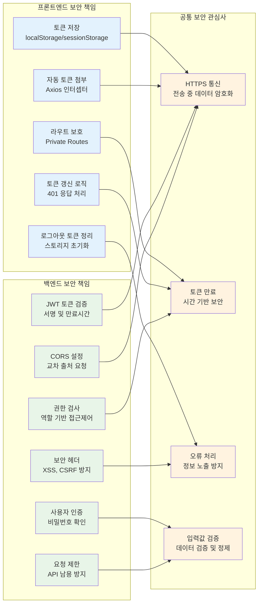

# YouSum (유썸) - AI 기반 유튜브 영상 요약 및 학습 지원 플랫폼


## 📌 프로젝트 소개 (Overview)

**YouSum**은 능동적 학습자를 위한 AI 기반 유튜브 영상 요약 및 학습 지원 플랫폼입니다. 
OpenAI의 Whisper와 GPT API를 활용하여 유튜브 영상을 자동으로 요약하고, 퀴즈 생성, 리마인드 기능, 개인화된 학습 지원을 제공합니다.

### 🎯 핵심 목적
- **효율적 학습**: 긴 유튜브 영상을 빠르게 요약하여 핵심 내용 파악
- **능동적 학습**: AI 생성 퀴즈를 통한 학습 내용 점검 및 복습
- **개인화 서비스**: 사용자 맞춤형 영상 추천 및 학습 관리
- **지속적 학습**: 리마인드 알림을 통한 체계적인 복습 지원

## ✨ 핵심 기능 (Key Features)

### 🎬 영상 처리 및 요약
- **Whisper STT**: 유튜브 영상 오디오를 텍스트로 변환
- **다양한 요약 형식**: 기본 요약, 3줄 요약, 키워드 요약, 타임라인 요약
- **목적별 맞춤 요약**: 사용자가 지정한 목적에 따른 개인화된 요약 생성
- **자동 해시태그 생성**: AI 기반 콘텐츠 분류 및 태그 자동 생성

### 📚 개인 학습 관리
- **사용자 라이브러리**: 요약된 콘텐츠 저장 및 개인 메모 추가
- **태그 기반 검색**: 해시태그를 활용한 효율적인 콘텐츠 검색
- **학습 통계 시각화**: 태그별 학습 현황 및 활동 로그 분석

### 🧠 AI 기반 학습 지원
- **자동 퀴즈 생성**: 요약 내용 기반 OX/객관식 문제 자동 출제
- **즉시 피드백**: 정답 확인 및 상세 해설 제공
- **개인화 추천**: 학습 이력 기반 관련 영상 추천

### 🔔 학습 지속성 지원
- **리마인드 알림**: 이메일 기반 복습 알림 (일간/주간/커스텀)
- **학습 기록 추적**: 사용자 활동 로그 및 학습 패턴 분석

### 🔐 사용자 인증 및 보안
- **JWT 기반 인증**: 안전한 토큰 기반 사용자 인증
- **OAuth2 구글 로그인**: 간편한 소셜 로그인 지원
- **비밀번호 암호화**: BCrypt를 활용한 안전한 비밀번호 저장

## 🛠 기술 스택 (Tech Stack)

### Backend
- **Framework**: Spring Boot 3.x
- **Security**: Spring Security (JWT + OAuth2)
- **Database**: MySQL 8.0, Redis
- **ORM**: JPA, QueryDSL
- **AI Services**: OpenAI Whisper API, GPT API
- **External API**: YouTube Data API v3

### Infrastructure
- **Cloud**: AWS (EC2, S3, RDS, Lambda)
- **Containerization**: Docker
- **Build Tool**: Gradle
- **Monitoring**: Spring Boot Actuator, AWS CloudWatch

### Development Tools
- **Testing**: JUnit 5, Mockito, TestContainers
- **Code Quality**: SonarQube
- **Documentation**: Swagger/OpenAPI

## 🏗 시스템 아키텍처 (Architecture)

### 전체 시스템 구조
```
┌─────────────────┐    API 호출    ┌──────────────────────┐
│   React Web    │ ──────────────► │  Spring Boot API     │
│   Frontend     │                 │      Server          │
└─────────────────┘                 └──────────────────────┘
                                              │
                    ┌─────────────────────────┼─────────────────────────┐
                    │                         │                         │
                    ▼                         ▼                         ▼
        ┌──────────────────┐    ┌──────────────────┐    ┌──────────────────┐
        │   OpenAI APIs    │    │   YouTube API    │    │   MySQL + Redis  │
        │ • Whisper (STT)  │    │ • 영상 메타데이터   │    │ • 사용자 데이터    │
        │ • GPT (요약/퀴즈) │    │ • 썸네일, 제목     │    │ • 요약/퀴즈 데이터 │
        └──────────────────┘    └──────────────────┘    └──────────────────┘
                    │
                    ▼
        ┌──────────────────────────────────────────────────────────────────┐
        │                      AWS Infrastructure                          │
        │  ┌─────────┐  ┌─────────┐  ┌─────────┐  ┌─────────┐           │
        │  │   EC2   │  │   S3    │  │   RDS   │  │ Lambda  │           │
        │  │서버호스팅 │  │파일저장  │  │ MySQL  │  │자동화   │           │
        │  └─────────┘  └─────────┘  └─────────┘  └─────────┘           │
        └──────────────────────────────────────────────────────────────────┘
```

### 주요 기능별 시퀀스 다이어그램

#### 1. 영상 요약 생성 플로우


#### 2. 퀴즈 생성 및 풀이 플로우


#### 3. 사용자 인증 플로우


#### 4. 라이브러리 관리 및 리마인드 플로우


## 📁 폴더 구조 (Project Structure)

```
src/main/java/com/kdt/yts/YouSumback/
├── 📁 config/                    # 설정 클래스
│   ├── AppConfig.java
│   ├── OpenAIConfig.java
│   └── WebConfig.java
├── 📁 controller/                # REST API 컨트롤러
│   ├── AuthController.java       # 인증 관련
│   ├── SummaryController.java    # 요약 기능
│   ├── QuizController.java       # 퀴즈 기능
│   ├── UserLibraryController.java # 사용자 라이브러리
│   ├── ReminderController.java   # 리마인드 기능
│   └── VideoRecommendationController.java # 추천 기능
├── 📁 model/
│   ├── 📁 entity/               # JPA 엔티티
│   │   ├── User.java
│   │   ├── Video.java
│   │   ├── Summary.java
│   │   ├── Quiz.java
│   │   └── UserLibrary.java
│   └── 📁 dto/                  # 데이터 전송 객체
│       ├── 📁 request/
│       └── 📁 response/
├── 📁 service/                  # 비즈니스 로직
│   ├── AuthService.java
│   ├── SummaryServiceImpl.java
│   ├── QuizServiceImpl.java
│   ├── UserLibraryService.java
│   └── 📁 client/              # 외부 API 클라이언트
│       ├── OpenAIClient.java
│       └── YouTubeClient.java
├── 📁 repository/              # 데이터 액세스 계층
├── 📁 security/               # 보안 설정
│   ├── SecurityConfig.java
│   ├── JwtProvider.java
│   └── OAuth2LoginSuccessHandler.java
├── 📁 exception/              # 예외 처리
│   ├── GlobalExceptionHandler.java
│   └── UserAlreadyExistsException.java
└── 📁 Util/                   # 유틸리티 클래스
    ├── TextCleaner.java
    └── WhisperRunner.java
```

## 🚀 설치 및 실행 방법 (Getting Started)

### 사전 요구사항
- Java 17 이상
- MySQL 8.0
- Redis
- Docker (Whisper 처리용)

### 1. 프로젝트 클론
```bash
git clone https://github.com/your-repo/yousum-backend.git
cd yousum-backend
```

### 2. 환경 변수 설정
```bash
# Windows PowerShell에서 실행
./set-env.ps1
```

또는 직접 환경 변수 설정:
```bash
export OPENAI_API_KEY=your_openai_api_key
export YOUTUBE_API_KEY=your_youtube_api_key
export GOOGLE_OAUTH_CLIENT_ID=your_google_client_id
export GOOGLE_OAUTH_CLIENT_SECRET=your_google_client_secret
```

### 3. 데이터베이스 설정
```sql
CREATE DATABASE yousum;
```

### 4. 애플리케이션 실행
```bash
./gradlew bootRun
```

### 5. API 문서 확인
서버 실행 후 다음 URL에서 API 문서를 확인할 수 있습니다:
- Swagger UI: `http://localhost:8080/swagger-ui.html`

## 🎮 요약 대기 미니게임 (Summary Typing Game)

AI가 영상을 요약하는 동안 사용자의 대기 시간을 줄이기 위한 **타이핑 게임**을 제공합니다.

### 게임 특징
- **교육적 콘텐츠**: 학습 관련 단어 및 문장으로 구성
- **실시간 피드백**: 타이핑 속도 및 정확도 측정
- **레벨 시스템**: 사용자 실력에 따른 난이도 조절
- **점수 시스템**: 게임 결과를 통한 성취감 제공

이 기능은 단순한 대기 시간을 유익한 학습 시간으로 전환하여 사용자 경험을 향상시킵니다.

## 👥 팀 소개 (Team YouSum)

| 역할 | 이름 | 담당 영역 | GitHub |
|------|------|-----------|---------|
| **팀 리더** | 석예은 | 프로젝트 총괄, Full-Stack 개발 | [@yeeun-suk](https://github.com/yeeun-suk) |
| **프론트엔드** | 김지원 | React UI/UX, AI 연동 | [@jiwon-kim](https://github.com/jiwon-kim) |
| **프론트엔드** | 정준호 | React 컴포넌트, API 연동 | [@joonho-jung](https://github.com/joonho-jung) |
| **백엔드** | 윤정수 | Spring Boot API, Whisper STT | [@jungsu-yoon](https://github.com/jungsu-yoon) |
| **백엔드** | 최도영 | 인프라 구축, AWS 배포 | [@doyoung-choi](https://github.com/doyoung-choi) |

### 🏆 팀 역량
- **풀스택 개발**: React + Spring Boot 기반 완전한 웹 애플리케이션 구축
- **AI 통합**: OpenAI API를 활용한 실용적인 AI 서비스 개발
- **클라우드 인프라**: AWS 기반 확장 가능한 서비스 아키텍처 구성
- **사용자 중심 설계**: 실제 학습자의 니즈를 반영한 기능 개발

## 📚 문서 링크 (Docs)

- **[소프트웨어 요구사항 명세서 (SRS)](./docs/SRS-YTS-001.md)**: 전체 시스템 요구사항 정의
- **[기술 스택 가이드](./docs/tech-stack.md)**: 사용된 기술 스택 상세 설명
- **[개발 가이드](./docs/development-guide.md)**: 개발 컨벤션 및 아키텍처 가이드
- **[API 문서](./docs/api-docs.md)**: REST API 엔드포인트 상세 명세
- **[배포 가이드](./docs/deployment.md)**: AWS 기반 배포 절차

## 🛣 향후 계획 (Roadmap)

### Phase 1: 핵심 기능 완성 ✅
- [x] 유튜브 영상 요약 기능
- [x] 사용자 인증 및 라이브러리
- [x] AI 기반 퀴즈 생성
- [x] 리마인드 알림 시스템

### Phase 2: 사용자 경험 개선 🚧
- [ ] 요약 대기 중 미니게임 추가
- [ ] 모바일 반응형 UI 최적화
- [ ] 실시간 알림 시스템 (WebSocket)
- [ ] 다국어 지원 (영어, 일본어)

### Phase 3: 고도화 기능 📋
- [ ] 영상 북마크 및 구간별 메모
- [ ] 협업 학습 기능 (그룹 스터디)
- [ ] 학습 진도 관리 시스템
- [ ] AI 기반 개인 맞춤 학습 경로 추천

### Phase 4: 확장성 강화 🔮
- [ ] 마이크로서비스 아키텍처 전환
- [ ] Kubernetes 기반 컨테이너 오케스트레이션
- [ ] 실시간 데이터 처리 (Apache Kafka)
- [ ] 머신러닝 모델 자체 구축

---

# 🔐 YouSum 백엔드-프론트엔드 보안 구조 분석

## 📊 전체 보안 아키텍처

### 1. 보안 계층 구조
이 다이어그램은 YouSum 플랫폼의 전체 보안 아키텍처를 5개 계층으로 나누어 보여줍니다. 프론트엔드에서 시작된 요청이 네트워크 계층을 거쳐 백엔드 보안 필터들을 통과하고, 인증/인가 시스템을 거쳐 최종적으로 데이터 계층에 도달하는 전체 흐름을 시각화합니다.



**계층별 주요 역할:**
- **프론트엔드 계층**: 사용자 인터페이스, HTTP 클라이언트, 토큰 저장 및 상태 관리
- **네트워크 계층**: HTTPS 통신, CORS 정책 적용, 인증 헤더 전송
- **백엔드 보안 계층**: Spring Security 필터 체인을 통한 요청 검증 및 인증 처리
- **인증/인가 계층**: JWT 토큰 관리, 사용자 정보 로딩, 비밀번호 암호화, OAuth2 처리
- **데이터 계층**: 사용자 인증 정보 저장, 보안 키 관리

## 🔄 JWT 기반 API 인증 플로우

### 2. 보호된 API 접근 시퀀스
이 시퀀스 다이어그램은 사용자가 보호된 API 엔드포인트에 접근할 때의 전체 인증 과정을 보여줍니다. JWT 토큰의 검증부터 사용자 정보 로딩, 보안 컨텍스트 설정까지의 상세한 흐름을 시각화합니다.



**주요 처리 단계:**
1. **CORS 검증**: 프론트엔드 도메인(localhost:5173) 허용 여부 확인
2. **토큰 추출**: Authorization 헤더에서 Bearer 토큰 추출
3. **토큰 검증**: JWT 서명 및 만료시간 확인
4. **사용자 로딩**: 토큰에서 추출한 사용자 ID로 데이터베이스 조회
5. **컨텍스트 설정**: Spring Security Context에 인증 정보 저장

## 🔑 사용자 인증 플로우

### 3. 로그인 인증 시퀀스 (일반 로그인 + OAuth2)
이 다이어그램은 YouSum 플랫폼에서 지원하는 두 가지 로그인 방식을 보여줍니다. 일반적인 아이디/비밀번호 로그인과 구글 OAuth2 소셜 로그인의 전체 과정을 비교하여 시각화합니다.



**인증 방식별 특징:**
- **일반 로그인**: BCrypt를 사용한 비밀번호 해시 검증, 데이터베이스 기반 사용자 확인
- **OAuth2 로그인**: 구글 계정 연동, 별도 비밀번호 불필요, 자동 회원가입 지원

## ⚖️ 보안 책임 분담

### 4. 프론트엔드 vs 백엔드 보안 역할
이 다이어그램은 YouSum 플랫폼에서 프론트엔드(YouSumFront)와 백엔드가 각각 담당하는 보안 책임을 명확히 구분하여 보여줍니다. 또한 양쪽이 공통으로 고려해야 할 보안 관심사도 함께 표시합니다.



**역할 분담 상세:**

**프론트엔드 보안 책임:**
- **토큰 관리**: JWT 토큰의 안전한 저장 및 자동 첨부
- **라우트 보호**: 인증되지 않은 사용자의 접근 차단
- **세션 관리**: 로그아웃 시 토큰 정리 및 401 오류 대응

**백엔드 보안 책임:**
- **토큰 검증**: JWT 서명 및 만료시간 확인
- **인증/인가**: 사용자 신원 확인 및 권한 검사
- **보안 정책**: CORS, 보안 헤더, Rate Limiting 적용

**공통 보안 관심사:**
- **통신 보안**: HTTPS를 통한 데이터 암호화
- **시간 기반 보안**: 토큰 만료를 통한 세션 관리
- **입력값 검증**: 클라이언트와 서버 양쪽에서의 데이터 검증

---

## 🛡️ 프론트엔드 보안 구현 가이드 (YouSumFront)

### Axios 인터셉터 설정 예시
```javascript
// 요청 인터셉터 - 자동 토큰 첨부
axios.interceptors.request.use(
  (config) => {
    const token = localStorage.getItem('accessToken');
    if (token) {
      config.headers.Authorization = `Bearer ${token}`;
    }
    return config;
  }
);

// 응답 인터셉터 - 401 에러 처리
axios.interceptors.response.use(
  (response) => response,
  (error) => {
    if (error.response?.status === 401) {
      localStorage.removeItem('accessToken');
      window.location.href = '/login';
    }
    return Promise.reject(error);
  }
);
```

### Protected Route 컴포넌트 예시
```javascript
const ProtectedRoute = ({ children }) => {
  const token = localStorage.getItem('accessToken');
  
  if (!token) {
    return <Navigate to="/login" replace />;
  }
  
  return children;
};
```

---

## 📄 라이선스

이 프로젝트는 MIT 라이선스 하에 배포됩니다. 자세한 내용은 [LICENSE](LICENSE) 파일을 참고하세요.

## 🤝 기여하기

프로젝트에 기여하고 싶으시다면:

1. Fork the Project
2. Create your Feature Branch (`git checkout -b feature/AmazingFeature`)
3. Commit your Changes (`git commit -m 'Add some AmazingFeature'`)
4. Push to the Branch (`git push origin feature/AmazingFeature`)
5. Open a Pull Request

---

<div align="center">

**YouSum Team** | 능동적 학습자를 위한 AI 기반 학습 플랫폼

[🌐 Website](https://yousum.com) • [📧 Contact](mailto:team@yousum.com) • [📱 Demo](https://demo.yousum.com)

</div> 
